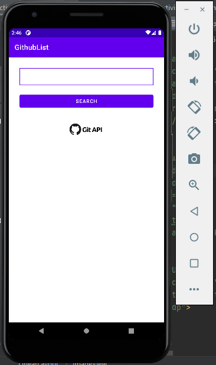
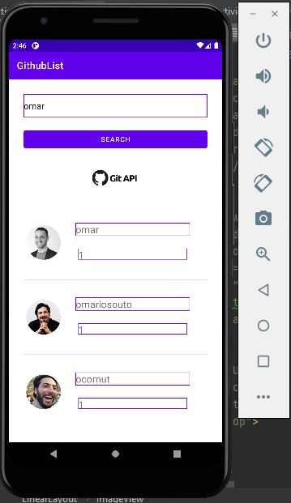
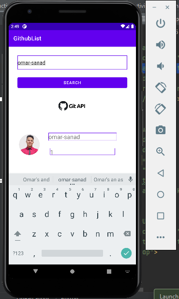
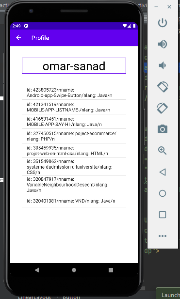

# MOBILE-APP-GithubList

<h3><u><b>the application is used to search github users using G itHub API </u></b></h3>

<h5>First interface :</h5>
 

  

<h5>Second interface :</h5>
 

  

<h5>Third interface :</h5>
 

 

<h5>Fourth interface :</h5>

 

